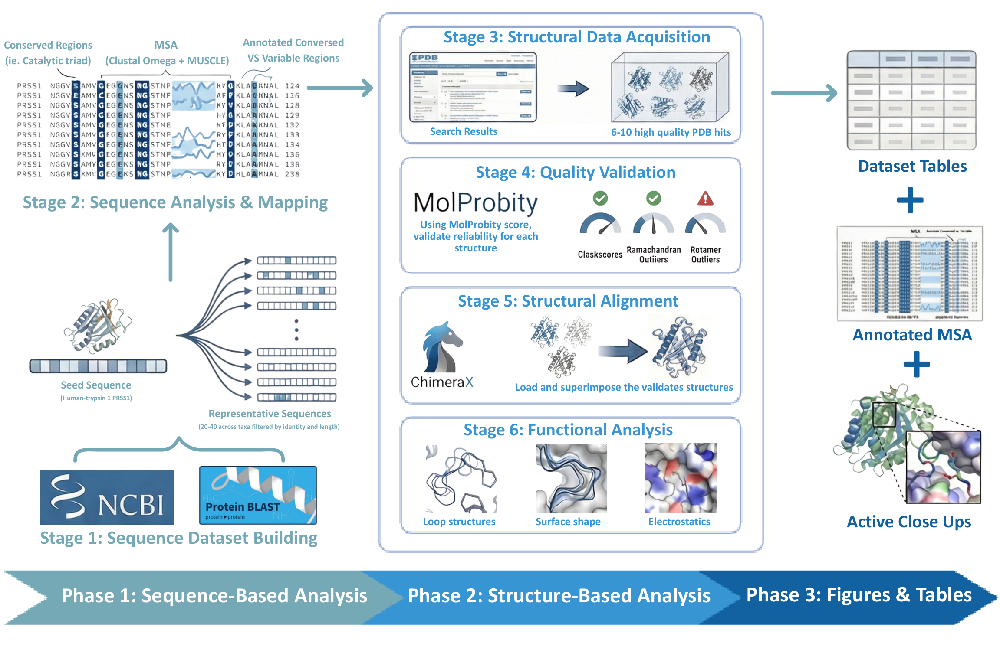
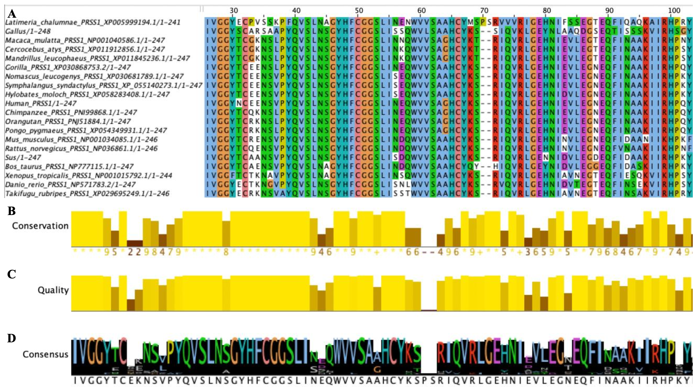
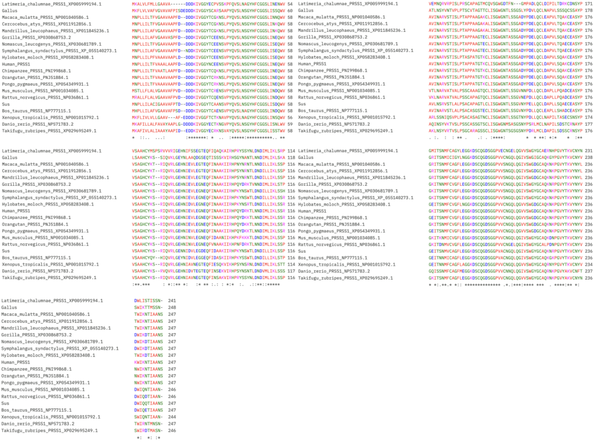
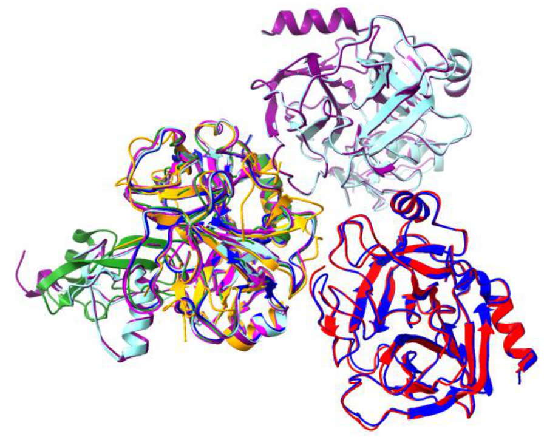
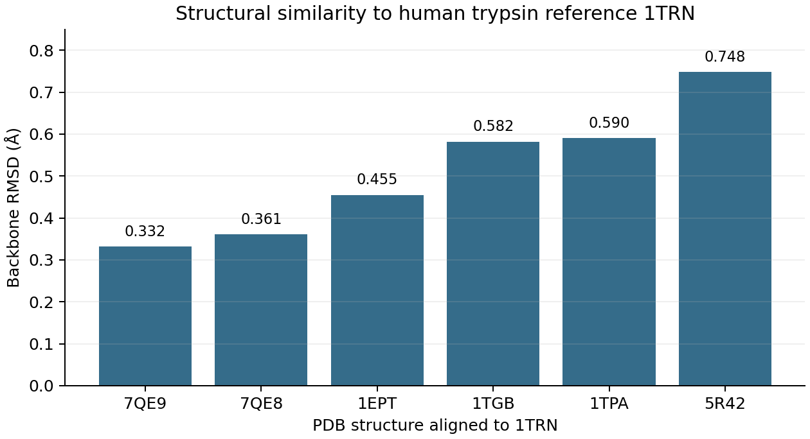

# Human Trypsin-1 (PRSS1) in protein evolution: sequence and structure across species

**Comparative protein Structural Bioinformatics project | University of Waterloo - BIOL 465 (Structural Bioinformatics) | 2026**

How can trypsin-like serine proteases retain the same catalytic mechanism while their substrate-recognition regions vary? I used human trypsin-1 (PRSS1) as a reference and compared protein homologs across species using sequence alignment and structural superposition.

This project connects to comparative genomics through cross-species homolog analysis. **The data analyzed here are protein sequences and protein structures, not whole genomes or nucleotide variants.**

## Tools and techniques

- **Sequence analysis:** BLASTp, Clustal Omega, MUSCLE, and Jalview for homolog selection and multiple sequence alignment
- **Structural analysis:** Protein Data Bank structures, MolProbity quality review, and ChimeraX MatchMaker for structural superposition
- **Comparisons:** Catalytic-triad conservation, substrate-binding pocket variation, and RMSD relative to human trypsin-1 (1TRN)

## At a glance

| Dataset | Analysis |
| --- | --- |
| 20 trypsin-like protein sequences | BLASTp-based selection, multiple sequence alignment, conserved and variable region inspection |
| Seven PDB structures, including reference 1TRN | Structure quality review, ChimeraX superposition, active-site and substrate-pocket comparison |
| Six pairwise comparisons to 1TRN | Backbone RMSD values from 0.332 to 0.748 Å |

## Methods and workflow

*Workflow diagram I created for this project. The sequence analysis and structure analysis are complementary comparisons; the diagram is an overview, not an executable pipeline.*

## Approach

1. Retrieved human PRSS1 protein sequence from NCBI and selected 20 homologous sequences across taxa from BLASTp results, filtering incomplete and redundant hits.
2. Aligned the proteins with Clustal Omega and MUSCLE; inspected the alignment in Jalview for conserved catalytic residues and variable regions near the active site.
3. Selected seven structures from the Protein Data Bank, reviewed structure quality with MolProbity, and superimposed the structures in ChimeraX using MatchMaker.
4. Compared catalytic-triad geometry and the S1 specificity pocket, including positions 189, 216, and 226. Recorded RMSD values relative to reference structure 1TRN.

## Multiple sequence alignment

*Selected Jalview alignment view from the 20 protein homologs. The conserved catalytic regions and surrounding variable positions guided the structure comparison. The source alignment is available as a [Clustal file](data/prss1_20_sequence_alignment.aln).*

View the complete 20-sequence alignment image

## Structural comparison

*Structural superposition from the course analysis; the RMSD values for the six structures compared with 1TRN are plotted below and provided in [CSV format](data/structure_rmsd_vs_1TRN.csv).*

## Main findings

- The catalytic-triad residues **His57, Asp102, and Ser195** and core motifs such as **IVGGY** and **HFCGGSL** were strongly conserved across the selected homologs.
- The overall trypsin-like fold and active-site geometry remained similar across the compared structures. The six recorded pairwise RMSDs ranged from **0.332 to 0.748 Å**.
- The substrate-binding pocket and nearby loops showed more variation than the catalytic core, consistent with differences in substrate recognition.

These are comparative observations from the selected homologs and structures; they do not establish substrate specificity experimentally.

## Files

- [`data/prss1_20_sequence_alignment.aln`](data/prss1_20_sequence_alignment.aln): Clustal-format alignment of the 20 selected protein sequences.
- [`data/structure_rmsd_vs_1TRN.csv`](data/structure_rmsd_vs_1TRN.csv): Six RMSD measurements from my analysis worksheet, with 1TRN as the reference.
- [`figures/rmsd_comparison.png`](figures/rmsd_comparison.png): Plot of the recorded RMSD values.
- [`figures/methods_workflow.png`](figures/methods_workflow.png): Original Canva methods diagram.
- [`figures/msa_conservation_summary.png`](figures/msa_conservation_summary.png): Jalview alignment, conservation, quality, and consensus figure from the report.
- [`figures/msa_full_alignment.png`](figures/msa_full_alignment.png): Full alignment image from the report appendix.
- [`figures/structural_superposition_1trn.png`](figures/structural_superposition_1trn.png): Figure showing the structural overlay.
- [`figures/triad_and_pocket_exploratory.png`](figures/triad_and_pocket_exploratory.png): Exploratory structure visualization highlighting catalytic and pocket positions.

## Scope and provenance

The sequence accessions are included in the alignment identifiers. Structure identifiers and measurements are recorded in the CSV. Protein sequences came from NCBI; structures came from the PDB. Figures were made for the original course project; the RMSD plot was recreated for this portfolio repository from the recorded measurements. This repository contains selected analysis outputs, **not a fully automated or independently reproducible pipeline**: the original BLAST search parameters, complete input FASTA and PDB files, and software versions are not included. The original course report is omitted from this package.

**Author:** Mishika Phogat
